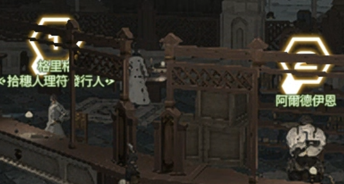

# autoLeve

Leves are too tedious. I don't want to do them manually anymore.

`autoLeve` is a semi-automatic **FFXIV crafting leve helper plugin** built using the **Dalamud plugin framework**.

It automates the repetitive workflow of accepting and turning in crafting leves in **Old Sharlayan**.

The plugin uses an **event-driven state machine** to detect NPC dialog windows and trigger the correct UI interactions during the leve workflow.

---

## Demo


Example automation flow:

Accept Leve (NPC A)  
↓  
Turn in Item (NPC B)  
↓  
Repeat  

Loop pattern:

A → B → A → B ...

The player stands between two NPCs and the plugin automates the leve interaction cycle.

---

## Features

- Semi-automatic leve workflow
- NPC interaction automation
- Dialog / UI event detection
- State machine based workflow control
- Configurable leve name
- Configurable loop count
- Manual start / stop control

---

## Main Window Usage

### Standing Position Reference

Use this corner standing position before starting:



Standing here allows interaction with both NPCs without moving.

---

### Required One-Time Manual Calibration

Before running the auto loop, you must manually locate the **Highland Tea** inventory slot once.

Steps:

1. Open the leve turn-in flow manually.
2. Use **Confirm Operation** to submit **Highland Tea** once.
3. This calibrates the inventory slot position for automation.

This step is required only once before using the automation loop.

---

### Setup Steps

1. Stand at the corner position near both NPCs in Old Sharlayan.

2. Target NPC A and click:

   標記目前目標為 attack1 (NPC A)

3. Target NPC B and click:

   標記目前目標為 attack2 (NPC B)

4. Set the target leve name.

   Example:

   治癒身心的茶

5. Set the target turn-in count:

   0 = unlimited loop

6. Confirm the one-time manual calibration is completed.

7. Click:

   開始自動循環 (A↔B)

8. Click **停止** anytime to stop the automation.

---

## Config Window

The Config window contains advanced options such as:

- UI delay timing
- callback behavior
- verbose logging

Most users only need to interact with the **Main Window**.

---

## Slash Commands

/alevetest semi on  
/alevetest semi off  
/alevetest semi start  
/alevetest semi stop  
/alevetest semi status  
/alevetest semi dump  

These commands allow quick control of the automation workflow.

---

## Technical Highlights

This project demonstrates several technical concepts:

- Dalamud plugin development
- FFXIV UI event monitoring
- Event-driven architecture
- State-machine based workflow control
- NPC interaction automation
- C# plugin architecture

The plugin monitors UI events and transitions through different workflow states to drive the automation logic.

---

## Project Structure

```
autoLeve
│
├─ Plugin.cs
│   Plugin entry point and initialization
│
├─ Windows/
│   Plugin UI windows
│
├─ Flow/
│   State machine controlling NPC interaction flow
│
├─ Hooks/
│   Game UI event detection
│
└─ Config/
    Plugin configuration management
```

---

## Build

Build using .NET:

```bash
dotnet build
```

Output:

```
autoLeve/bin/x64/Debug/autoLeve.dll
```

---

## Project Status

This project is a **personal experimental plugin**.

The implementation currently works for the intended workflow but may contain bugs or edge cases.

The purpose of this repository is to explore:

- Dalamud plugin development
- FFXIV UI automation
- Event-driven workflow design
- State machine based automation logic

The project is not actively maintained.

---

## Disclaimer

This project is for **educational and experimental purposes only**.

It demonstrates plugin development techniques using the Dalamud framework.
